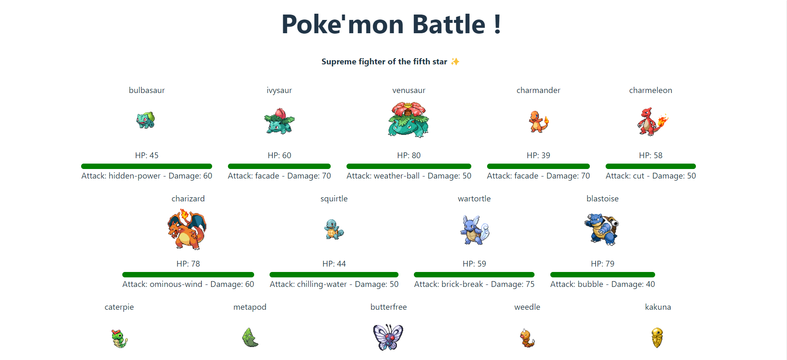
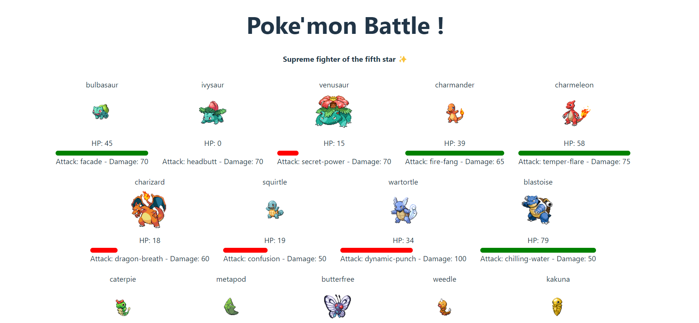

# Application Poké'mon Battle

## Description
Cette application en React permet de simuler des combats Pokémon en utilisant l'API Pokémon. Les utilisateurs peuvent sélectionner aléatoirement des attaques et faire s'affronter les Pokémon en les faisant glisser et déposer les uns sur les autres. De plus, en cliquant sur un Pokémon, son cri sera activé.

## Fonctionnalités
- Sélection aléatoire d'attaques
- Combat en glisser-déposer
- Activation des cris des Pokémon au clic

## Prérequis
- Node.js installé sur votre machine
- Connexion Internet pour accéder à l'API Pokémon

## Installation
1. Clonez ce dépôt sur votre machine.
2. Accédez au répertoire du projet dans votre terminal.
3. Exécutez la commande `npm install` pour installer les dépendances.

## Utilisation
1. Lancez l'application en exécutant la commande `npm start`.
2. Ouvrez votre navigateur et accédez à l'adresse indiquée dans votre terminal.
3. Commencez à sélectionner les attaques et à faire combattre les Pokémon en les faisant glisser et déposer.

## Fonctionnement de l'application

### Sélection aléatoire d'attaques
- L'application interroge l'API Pokémon au chargement pour obtenir une liste de Pokémon et de leurs attaques disponibles.
- À chaque nouveau combat, deux attaques sont sélectionnées aléatoirement pour chaque Pokémon impliqué.

### Combat en glisser-déposer
- Les Pokémon disponibles sont affichés s à l'écran.
- L'utilisateur peut sélectionner un Pokémon en le faisant glisser et déposer sur un autre.
- Le combat commence automatiquement.

### Déroulement du combat
- Les attaques infligent des dégâts à l'autre Pokémon, réduisant ses points de vie.

### Activation des cris des Pokémon
- En cliquant sur un Pokémon, l'application joue le cri caractéristique de ce Pokémon.

L'application vise à offrir une expérience interactive et divertissante aux utilisateurs, tout en leur permettant de découvrir les différents Pokémon et leurs capacités de combat.

## Contribution
Les contributions sont les bienvenues ! Si vous souhaitez contribuer à ce projet, veuillez ouvrir une issue pour discuter des changements que vous souhaitez apporter.

