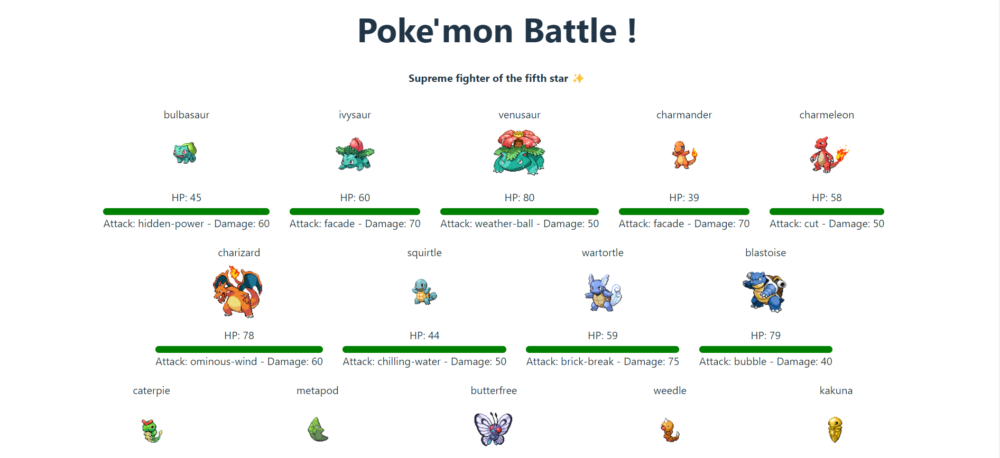
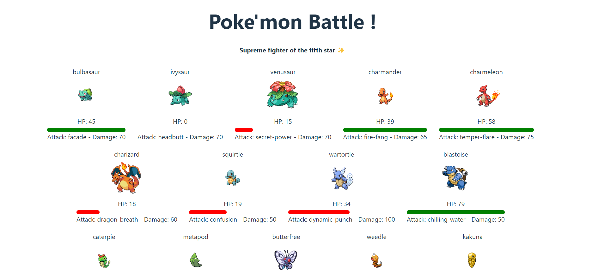

# ⚔️ Pokémon Battle App

## Description

This React application simulates Pokémon battles using the **Pokémon API**. Users can randomly select attacks and make Pokémon fight by dragging and dropping them onto each other. Additionally, clicking on a Pokémon triggers its unique cry.

## ✨ Features

- 🎲 **Random Attack Selection:** Moves are randomized for variety.
- 🖱️ **Drag-and-Drop Combat:** Intuitive mechanics to start battles.
- 🔊 **Sound Effects:** Activate Pokémon cries by clicking on them.

## 📋 Prerequisites

- **Node.js** installed on your machine.
- **Internet connection** to access the Pokémon API.

## 🚀 Installation

1. Clone this repository to your machine.
2. Navigate to the project directory in your terminal.
3. Run the following command to install dependencies:

```bash
npm install
```

## 🎮 Usage

1. Launch the application by running:

```bash
npm start
```

2. Open your browser and go to the address indicated in your terminal (usually `http://localhost:3000`).
3. Start selecting attacks and make Pokémon fight by dragging and dropping them.

## ⚙️ How it Works

### 🎲 Random Attack Selection

- The application queries the Pokémon API upon loading to fetch a list of Pokémon and their available moves.
- For every new battle, two attacks are randomly selected for each Pokémon involved.

### ⚔️ Drag-and-Drop Combat

- Available Pokémon are displayed on the screen.
- The user can select a Pokémon by dragging and dropping it onto another.
- The battle starts automatically upon drop.

### 📉 Combat Flow

- Attacks deal damage to the opponent, reducing their Health Points (HP).

### 🔊 Pokémon Cries

- By clicking on a Pokémon, the application plays the characteristic cry of that Pokémon.

The application aims to offer an interactive and entertaining experience for users, allowing them to discover different Pokémon and their combat abilities.

## 🤝 Contribution

Contributions are welcome! If you wish to contribute to this project, please open an issue to discuss the changes you would like to make.




